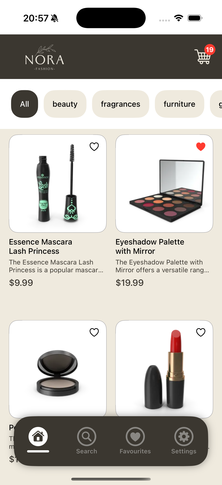
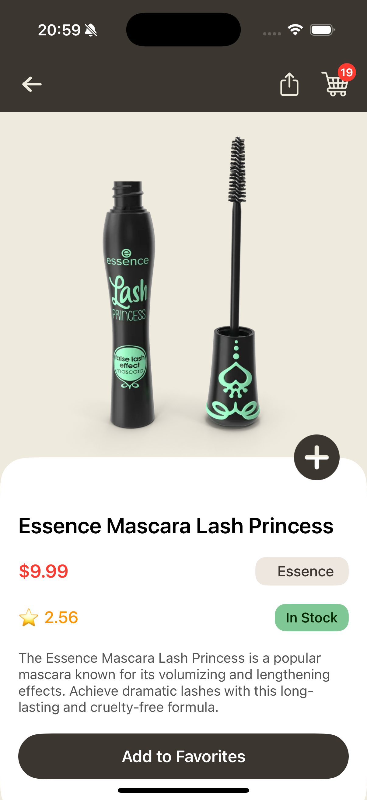
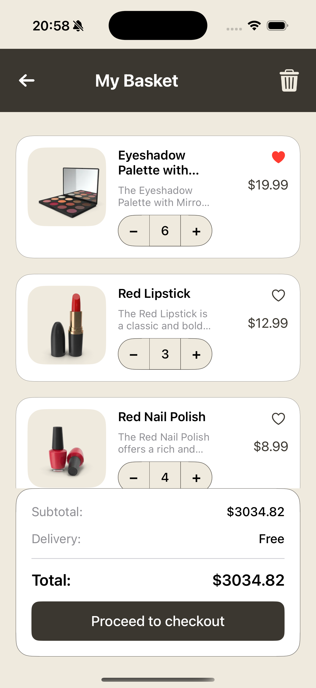
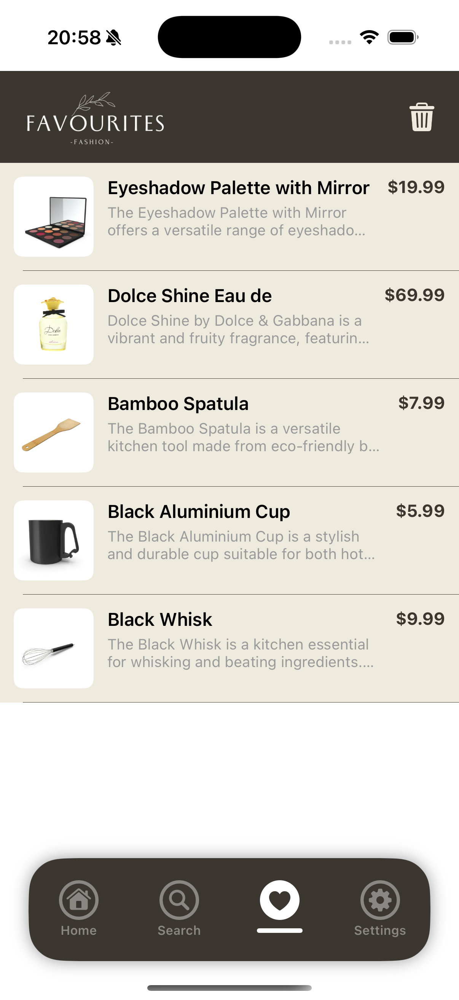
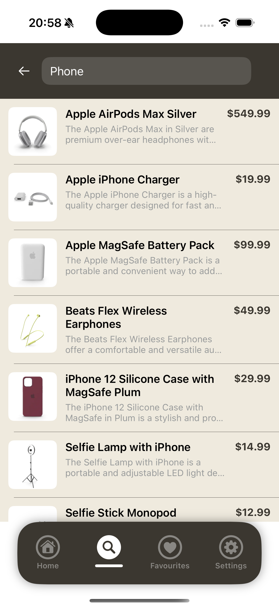
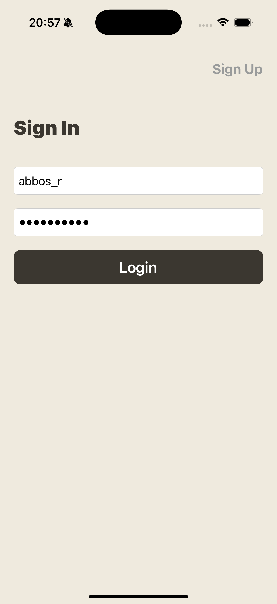
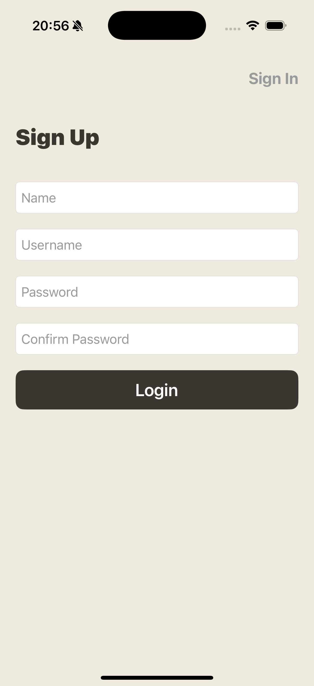
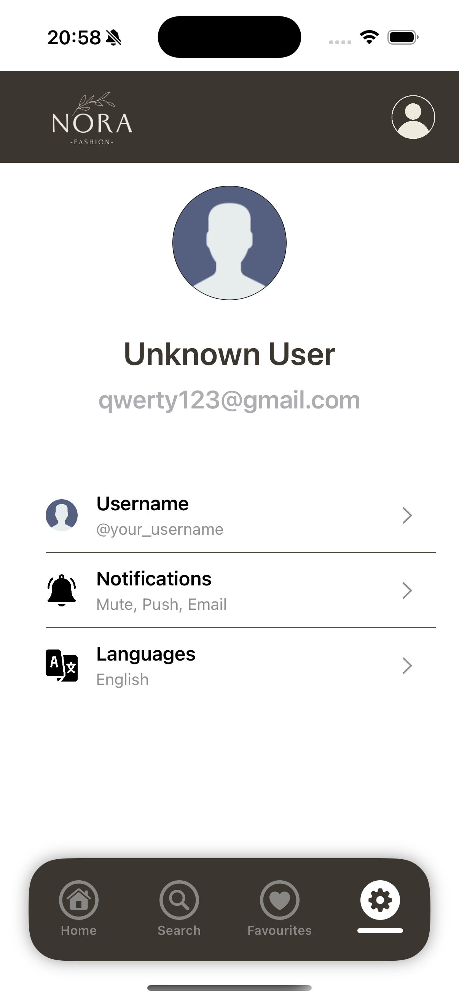

🛍 Nora Store

Nora Store is a full-stack e-commerce iOS application built with Swift (UIKit) on the frontend and Django REST Framework on the backend.

This project demonstrates real-world mobile development with authentication, API integration, and backend deployment.

⸻

📱 Overview

Nora Store allows users to:
	•	Browse products
	•	View product details
	•	Register & login
	•	Manage favorites
	•	Interact with a live backend API

The app communicates with a custom Django backend using RESTful APIs.

⸻

🚀 Features

🔐 Authentication
	•	User registration
	•	Login / Logout
	•	Token-based authentication
	•	Secure API requests

🛍 Store Functionality
	•	Product listing
	•	Product detail screen
	•	Add / Remove favorites
	•	Basic cart logic

🌐 Backend
	•	Django REST Framework
	•	Custom API endpoints
	•	Database integration
	•	Deployed backend server

⸻

🛠 Technologies Used

📱 iOS
	•	Swift
	•	UIKit
	•	URLSession
	•	MVC Architecture
	•	Auto Layout
	•	Codable (JSON decoding)

🖥 Backend
	•	Django
	•	Django REST Framework
	•	Token Authentication
	•	Backend Deployment (Railway)

⸻

🧠 What I Learned

While building this full-stack project, I improved:
	•	REST API design and consumption
	•	Authentication flow between frontend & backend
	•	Token management
	•	Networking error handling
	•	Backend deployment process
	•	Working with production APIs
	•	Real-world Git workflow

  ## 📸 Screenshots

  
  
  

  
  
  

  
  

